# UML Diagrams – Automated Timetable System (IntelliScheduler)

All diagrams are written in PlantUML. Paste each block into https://www.plantuml.com/plantuml/uml/ or any PlantUML renderer.

---

## 1. System Architecture Diagram (C4 Context)

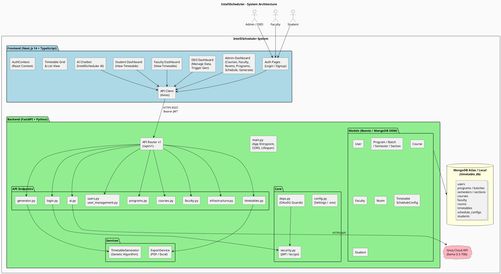

---

## 2. Class Diagram – Domain Models

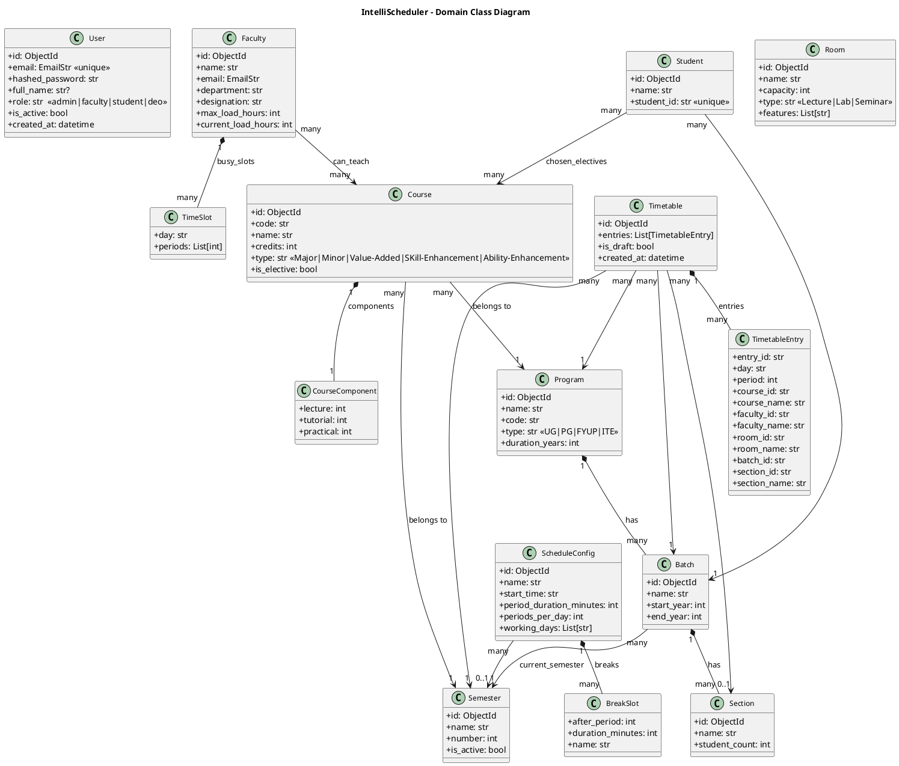

---

## 3. Entity Relationship Diagram (MongoDB Collections)

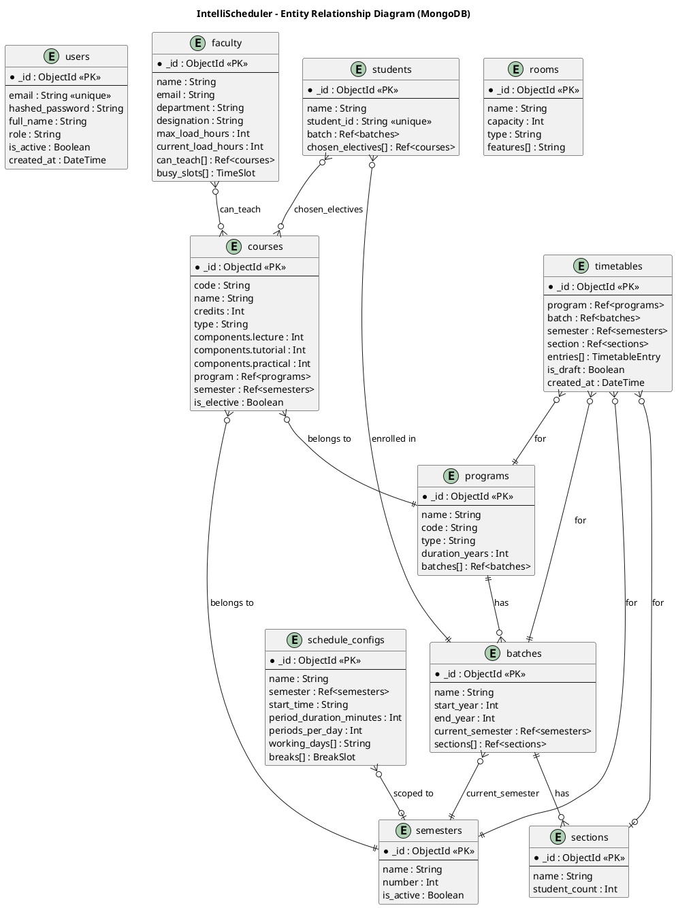

---

## 4. Use Case Diagram

```plantuml
@startuml Use_Case_Diagram
left to right direction
skinparam defaultFontName Helvetica
skinparam actorStyle awesome
title IntelliScheduler – Use Case Diagram

actor "Admin" as Admin
actor "DEO\n(Data Entry Officer)" as DEO
actor "Faculty" as Faculty
actor "Student" as Student
actor "Groq AI\nService" as AI <<system>>
actor "MongoDB" as DB <<system>>

rectangle "IntelliScheduler System" {

  package "Authentication" {
    usecase "Login" as UC_Login
    usecase "Signup" as UC_Signup
    usecase "Logout" as UC_Logout
  }

  package "User Management" {
    usecase "Create / Edit / Delete Users" as UC_Users
    usecase "Assign Roles" as UC_Roles
    usecase "View All Users" as UC_ViewUsers
  }

  package "Academic Data Management" {
    usecase "Manage Programs\n(CRUD)" as UC_Programs
    usecase "Manage Batches &\nSections" as UC_Batches
    usecase "Manage Semesters" as UC_Semesters
    usecase "Manage Courses\n(CRUD + Components)" as UC_Courses
    usecase "Manage Faculty\n(CRUD + Workload)" as UC_Faculty
    usecase "Manage Rooms\n(CRUD)" as UC_Rooms
    usecase "Set Schedule Config\n(Timings, Breaks)" as UC_ScheduleConf
  }

  package "Timetable Operations" {
    usecase "Generate Timetable\n(GA Engine)" as UC_Generate
    usecase "View Timetable\n(Grid / List)" as UC_ViewTT
    usecase "Edit Timetable\nEntry" as UC_EditTT
    usecase "Publish / Approve\nTimetable" as UC_Publish
    usecase "Export Timetable\n(PDF / Excel)" as UC_Export
    usecase "Simulate Timetable" as UC_Simulate
  }

  package "AI Features" {
    usecase "Chat with AI\n(IntelliScheduler AI)" as UC_Chat
    usecase "AI Analysis of\nTimetable Quality" as UC_Analysis
    usecase "AI Dashboard\nInsights" as UC_Insights
  }

  package "Student / Faculty Self Service" {
    usecase "View Own Timetable" as UC_Own
    usecase "Choose Electives" as UC_Electives
  }
}

' Admin associations
Admin --> UC_Login
Admin --> UC_Users
Admin --> UC_Roles
Admin --> UC_ViewUsers
Admin --> UC_Programs
Admin --> UC_Batches
Admin --> UC_Semesters
Admin --> UC_Courses
Admin --> UC_Faculty
Admin --> UC_Rooms
Admin --> UC_ScheduleConf
Admin --> UC_Generate
Admin --> UC_ViewTT
Admin --> UC_EditTT
Admin --> UC_Publish
Admin --> UC_Export
Admin --> UC_Chat
Admin --> UC_Analysis
Admin --> UC_Insights
Admin --> UC_Simulate

' DEO associations
DEO --> UC_Login
DEO --> UC_Programs
DEO --> UC_Batches
DEO --> UC_Semesters
DEO --> UC_Courses
DEO --> UC_Faculty
DEO --> UC_Rooms
DEO --> UC_Generate
DEO --> UC_ViewTT
DEO --> UC_EditTT
DEO --> UC_Export
DEO --> UC_Chat
DEO --> UC_Analysis

' Faculty associations
Faculty --> UC_Login
Faculty --> UC_Own
Faculty --> UC_Chat

' Student associations
Student --> UC_Login
Student --> UC_Signup
Student --> UC_Own
Student --> UC_Electives
Student --> UC_Chat

' System associations
UC_Chat --> AI
UC_Analysis --> AI
UC_Insights --> AI
UC_Generate --> DB
UC_Login --> DB

@enduml
```

---

## 5. Sequence Diagram – Authentication (Login Flow)

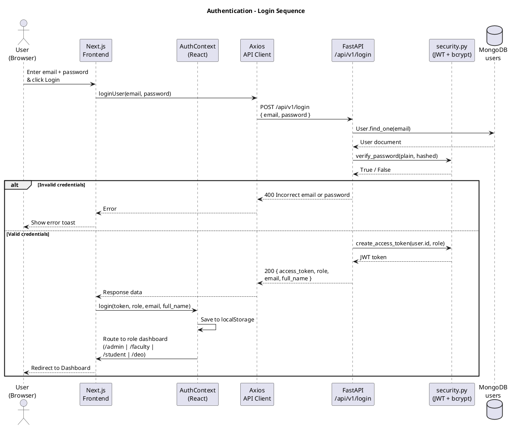

---

## 6. Sequence Diagram – Timetable Generation (Genetic Algorithm)

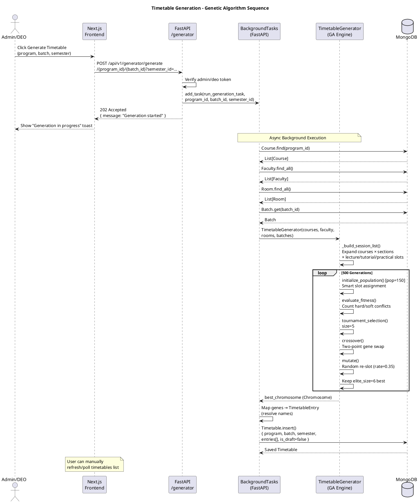

---

## 7. Sequence Diagram – AI Chat

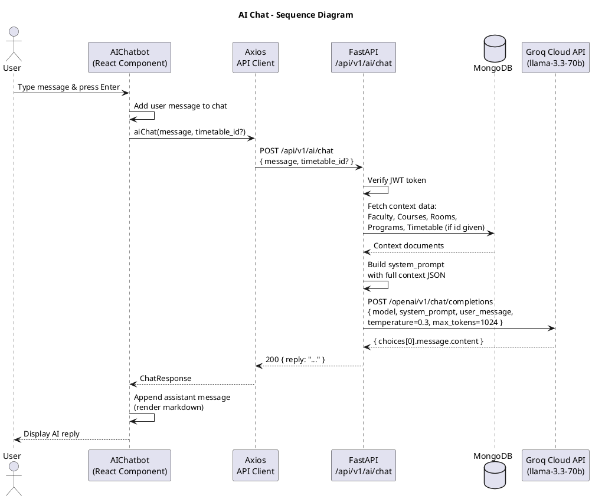

---

## 8. Sequence Diagram – Export Timetable

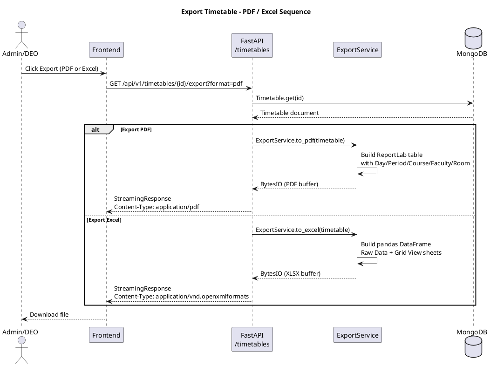

---

## 9. Component Diagram – Backend

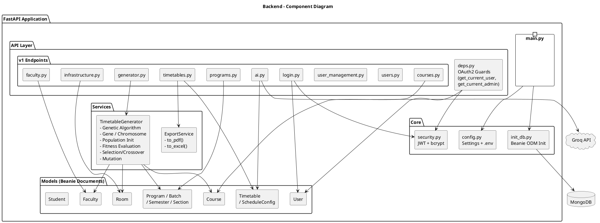

---

## 10. Component Diagram – Frontend

```plantuml
@startuml Component_Frontend
skinparam defaultFontName Helvetica
skinparam componentStyle rectangle
title Frontend – Component Diagram (Next.js)

package "Next.js App Router" {

  package "Layout & Providers" {
    component "layout.tsx\n(Root Layout)" as RootLayout
    component "providers.tsx\n(QueryClientProvider)" as Providers
    component "AuthContext.tsx\n(React Context)" as AuthCtx
    component "Sidebar.tsx" as Sidebar
    component "(dashboard)/layout.tsx" as DashLayout
  }

  package "Auth Pages" {
    component "login/page.tsx" as LoginPage
    component "signup/page.tsx" as SignupPage
  }

  package "Admin Pages" {
    component "admin/page.tsx\n(Dashboard Overview)" as AdminHome
    component "admin/courses/page.tsx" as AdminCourses
    component "admin/faculty/page.tsx" as AdminFaculty
    component "admin/programs/page.tsx" as AdminPrograms
    component "admin/rooms/page.tsx" as AdminRooms
    component "admin/generate/page.tsx" as AdminGenerate
    component "admin/timetables/page.tsx" as AdminTimetables
    component "admin/schedule/page.tsx" as AdminSchedule
    component "admin/users/page.tsx" as AdminUsers
  }

  package "DEO Pages" {
    component "deo/page.tsx" as DeoHome
    component "deo/courses, faculty,\nprograms, rooms,\ngenerate, timetables,\nschedule" as DeoPages
  }

  package "Faculty Pages" {
    component "faculty/page.tsx" as FacultyHome
    component "faculty/timetable/page.tsx" as FacultyTT
  }

  package "Student Pages" {
    component "student/page.tsx" as StudentHome
    component "student/timetable/page.tsx" as StudentTT
  }

  package "Shared Components" {
    component "TimetableGrid.tsx" as TTGrid
    component "TimetableListView.tsx" as TTList
    component "AIChatbot.tsx\n(IntelliScheduler AI)" as AIChat
    package "UI Primitives" {
      component "button, card, dialog,\ninput, label, select,\ntabs, textarea,\nbadge, toast" as UILib
    }
  }

  package "Library" {
    component "api.ts\n(Axios Client +\nAll API calls)" as ApiLib
    component "utils.ts\n(cn() etc.)" as Utils
  }
}

RootLayout --> Providers
Providers --> AuthCtx
DashLayout --> Sidebar
DashLayout --> AIChat
AdminHome --> TTGrid
AdminTimetables --> TTGrid
AdminTimetables --> TTList
FacultyTT --> TTGrid
StudentTT --> TTGrid

LoginPage --> ApiLib
SignupPage --> ApiLib
AdminCourses --> ApiLib
AdminFaculty --> ApiLib
AdminPrograms --> ApiLib
AdminRooms --> ApiLib
AdminGenerate --> ApiLib
AdminTimetables --> ApiLib
AdminUsers --> ApiLib
AIChat --> ApiLib

@enduml
```

---

## 11. Activity Diagram – Genetic Algorithm (Timetable Generation)

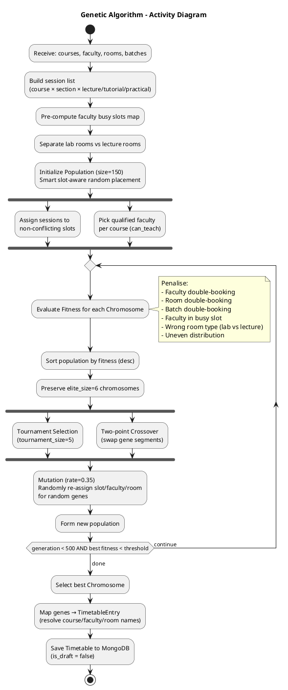

---

## 12. State Diagram – Timetable Lifecycle

```plantuml
@startuml State_Timetable
skinparam defaultFontName Helvetica
title Timetable – State Diagram

[*] --> Pending : Admin triggers generation

state Pending {
  : Awaiting background task
}

Pending --> Generating : Background task starts\n(GA engine runs)

state Generating {
  : Running 500 generations
  : Evaluating fitness
}

Generating --> Draft : GA completes\nis_draft = true

state Draft {
  : Entries created\nEditable by Admin/DEO
}

Draft --> Draft : Admin edits\nentries manually

Draft --> Published : Admin publishes\n(is_draft = false)

state Published {
  : Visible to Faculty & Students
}

Published --> Draft : Reverted for changes

Published --> Exported : Export triggered

state Exported {
  : PDF / Excel downloaded
}

Exported --> Published : Still accessible

Draft --> [*] : Deleted

Published --> [*] : Deleted

@enduml
```

---

## 13. Sequence Diagram – Dependency Injection & Auth Guard

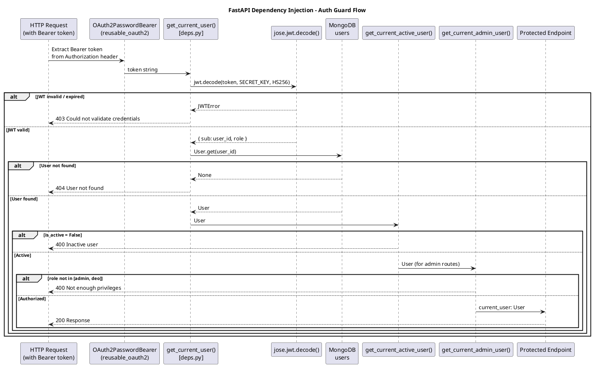

---

## 14. Deployment Diagram

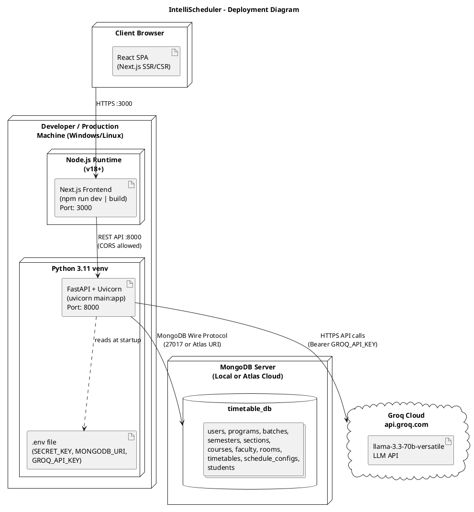

---

## 15. Package / Module Dependency Diagram

```plantuml
@startuml Package_Dependency
skinparam defaultFontName Helvetica
title Backend – Package / Module Dependencies

package "main.py" as MAIN
package "app.core" as CORE {
  class config
  class security
}
package "app.db" as DBPKG {
  class init_db
}
package "app.models" as MODELS {
  class users
  class programs
  class courses
  class faculty
  class infrastructure
  class timetable
  class student
}
package "app.schemas" as SCHEMAS {
  class "user\ncourses\nfaculty\nprograms\ninfrastructure\ntimetable\nstudent" as schemas_all
}
package "app.api" as API {
  package "app.api.v1.endpoints" as ENDPOINTS {
    class login
    class users
    class programs
    class courses
    class faculty
    class infrastructure
    class timetables
    class generator
    class ai
    class user_management
  }
  class deps
}
package "app.services" as SERVICES {
  class "generator\n(TimetableGenerator)" as gen_svc
  class "export\n(ExportService)" as exp_svc
}

MAIN --> CORE
MAIN --> DBPKG
MAIN --> API
DBPKG --> MODELS
ENDPOINTS --> MODELS
ENDPOINTS --> SCHEMAS
ENDPOINTS --> CORE
ENDPOINTS --> deps
deps --> CORE
deps --> MODELS
ENDPOINTS ..> SERVICES : uses
SERVICES --> MODELS
gen_svc --> MODELS
exp_svc --> MODELS

@enduml
```

---

## Summary of All Diagrams

| # | Diagram | Type | Purpose |
|---|---------|------|---------|
| 1 | System Architecture | Architecture/C4 | Complete system overview |
| 2 | Domain Class Diagram | UML Class | All models + relationships |
| 3 | Entity Relationship Diagram | ERD | MongoDB collections schema |
| 4 | Use Case Diagram | UML Use Case | Actors & system features |
| 5 | Login Sequence | UML Sequence | JWT auth flow |
| 6 | Generation Sequence | UML Sequence | GA timetable generation |
| 7 | AI Chat Sequence | UML Sequence | Groq LLM chat flow |
| 8 | Export Sequence | UML Sequence | PDF/Excel export flow |
| 9 | Backend Component | UML Component | FastAPI layers |
| 10 | Frontend Component | UML Component | Next.js app structure |
| 11 | GA Activity | UML Activity | GA algorithm steps |
| 12 | Timetable State | UML State | Timetable lifecycle |
| 13 | Auth Guard Sequence | UML Sequence | Dependency injection flow |
| 14 | Deployment Diagram | UML Deployment | Infrastructure layout |
| 15 | Package Dependency | UML Package | Module dependencies |
